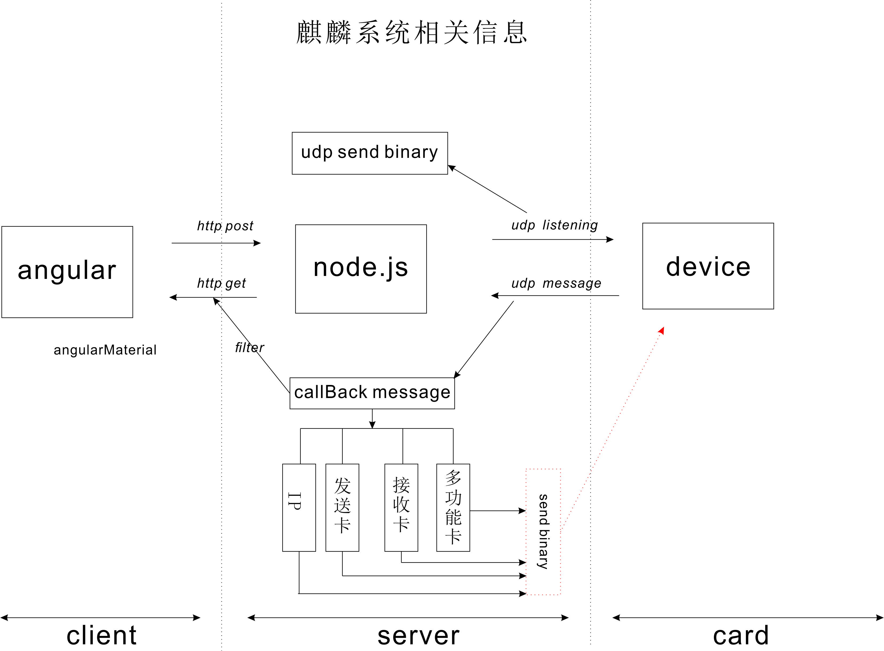

## 软件开发中软硬件结合
我们在软件开发中经常只会专注于一部分，比如前端开发，后端开发，客户端以及硬件开发等等，很少会涉及到一个全套的开发流程。最近参与开发的一个项目就涉及到全套流程开发，使用的技术栈为 angular + nodejs + is6f多功能卡

### 整体技术图如下

### angular  
angular在整个项目中主要为负责前端页面渲染，从后端获取数据在页面上呈现

### nodejs
nodejs在整个项目中主要用来起一个udp服务，通过发送binary到多功能卡中，获取多功能卡会读的传感器数据，分析过滤后给前端页面显示

### is6f 
is6f为多功能卡，主要用来控制多网口I/O，通过连接传感器等不同模组，来获取外部例如温湿度等信息
